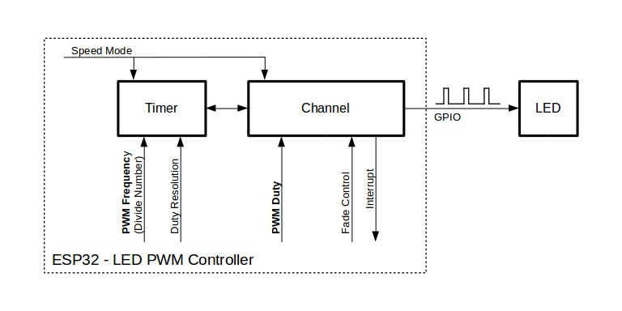

# PWM
also refered as LED Control (LEDC), is our main and only way to try to make analog signals, since there's no real DAC in our ESP32-S3 N16R8, (was removed in late 2021)

## Table of Contents
- [PWM](#pwm)
- [What is LEDC](#what-is-ledc)
- [Functionality Overview](#functionality-overview)
- [Timer Configuration](#timer-configuration)
- [Channel Configuration](#channel-configuration)
- [LEDC Channel Configuration Parameters](#ledc-channel-configuration-parameters)
- [Change PWM Duty Cycle Using Software](#change-pwm-duty-cycle-using-software)
- [Supported Range of Frequency and Duty Resolution (LEDC – ESP32-S3)](#supported-range-of-frequency-and-duty-resolution-ledc--esp32-s3)
- [Other Headers can be read](#other-headers-can-be-read)

## What is LEDC

LEDC channels are divided into two groups of 8 channels each:
- ***LEDC channels operates in high speed mode:***  
This mode is implemented in hardware and offers automatic and glitch-free changing of the PWM duty cycle
   
- ***The other group of channels operate in low speed mode:*** 
 
the PWM duty cycle must be changed by the driver in software. 

Each group of channels is also able to use different clock sources.  
The PWM controller can automatically increase or decrease the duty cycle gradually, allowing for fades without any processor interference.

---

## Functionality Overview

Setting up an LEDC channel (high-speed or low-speed) is done in **three steps**:

1. **[Timer Configuration](#timer-configuration)**  
   Define the PWM frequency and duty-resolution.

2. **Channel Configuration**  
   Link the channel to a timer and GPIO pin.

3. **Change PWM Signal**  
   Adjust the output duty (software control or hardware fading).

---

### Note
For initial setup, configure **timers first** (`ledc_timer_config()`), then **channels** (`ledc_channel_config()`).  
This guarantees the PWM frequency is correct the moment the IO pin starts outputting PWM.

---

## Timer Configuration

You configure a timer by calling `ledc_timer_config()` and passing a `ledc_timer_config_t` structure.  
The fields include:

---

### **Speed mode (`ledc_mode_t`)**

- **LEDC_HIGH_SPEED_MODE**
  - Faster internal hardware paths  
  - Glitch-free duty updates  
  - Historically needed on older ESP32 chips  
  - On ESP32-S3: available, but rarely necessary

- **LEDC_LOW_SPEED_MODE**
  - More flexible  
  - Recommended default on ESP32-S3  
  - Works for all normal PWM

---

### **Timer number (`ledc_timer_t`)**

A timer defines:

- PWM **frequency**
- PWM **resolution**

Available timers:

- `LEDC_TIMER_0`
- `LEDC_TIMER_1`
- `LEDC_TIMER_2`
- `LEDC_TIMER_3`

Each timer can drive **multiple channels**.

**Rule:**  
All channels using the same timer share the **same frequency and resolution**.  
Need different frequencies? → use **different timers**.

---

### **PWM frequency**

Frequency = how many ON/OFF cycles per second.

Typical values:

- **50 Hz** → Servos  
- **1 kHz** → LED dimming  
- **20 kHz** → DC motors (silent)  
- **38 kHz** → IR modulation  

General rules:

- Higher frequency → smoother for motors  
- Lower frequency → better for LEDs/servos  

---

### **PWM resolution**

Resolution = number of possible duty-cycle steps.

| Bits   | Steps           | Duty Range      |
|--------|-----------------|------------------|
| 8-bit  | 256             | 0–255            |
| 10-bit | 1024            | 0–1023           |
| 13-bit | 8192            | 0–8191           |
| 20-bit | 1,048,576       | 0–1,048,575      |

**Trade-off:**  
- Higher resolution → lower max frequency  
- Higher frequency → lower max resolution  

Because the timer clock is limited, you **cannot** have both at the same time.

---

### **Source clock (`ledc_clk_cfg_t`)**

The timer uses one of several base clocks.  
A higher clock → allows higher PWM frequency.

| Clock Name      | Clock Frequency | Speed Mode | Capabilities                                                      |
|-----------------|-----------------|------------|-------------------------------------------------------------------|
| **APB_CLK**     | 80 MHz          | High/Low   | —                                                                 |
| **REF_TICK**    | 1 MHz           | High/Low   | Dynamic Frequency Scaling compatible                             |
| **RC_FAST_CLK** | ~8 MHz          | Low        | Dynamic Frequency Scaling + Light-sleep compatible               |

Normally use `LEDC_AUTO_CLK`

---

### Deconfiguring an LEDC Timer

To *release* a timer using `ledc_timer_config()`, the `ledc_timer_config_t` structure must include:

- **speed_mode** (`ledc_mode_t`)  
  Speed mode of the timer you want to deconfigure.

- **timer_num** (`ledc_timer_t`)  
  The ID of the timer to deconfigure.

- **deconfigure** (`bool`)  
  Set to `true` to release the timer.

## Channel Configuration
When the timer is set up, configure the desired channel (one out of ledc_channel_t). This is done by calling the function `ledc_channel_config()`

Similar to the timer configuration, the channel setup function should be passed a structure ledc_channel_config_t that contains the channel's configuration parameters

this point, the channel should start operating and generating the PWM signal on the selected GPIO, as configured in `ledc_channel_config_t`, with the frequency specified in the timer settings and the given duty cycle. The channel operation (signal generation) can be suspended at any time by calling the function `ledc_stop()`.

## LEDC Channel Configuration Parameters

| Parameter | Type | What It Controls | Notes |
|----------|------|------------------|-------|
| `gpio_num` | `int` | The GPIO pin used for PWM output | Must be an output-capable pin |
| `speed_mode` | `ledc_mode_t` | Selects high-speed or low-speed group | Must match the timer’s mode |
| `channel` | `ledc_channel_t` | Which LEDC channel index to use | Each channel = one PWM output |
| `timer_sel` | `ledc_timer_t` | Which timer the channel uses | Determines PWM freq & resolution |
| `duty` | `uint32_t` | Initial duty cycle value | Range depends on timer resolution |
| `hpoint` | `uint32_t` | Where the duty begins inside the cycle | Usually set to 0 |
| `intr_type` | `ledc_intr_type_t` | Interrupt type for the channel | Usually disabled |

## Change PWM Duty Cycle Using Software

To set the duty cycle, use the dedicated function `ledc_set_duty()`. After that, call `ledc_update_duty()` to activate the changes. To check the currently set value, use the corresponding _get_ function `ledc_get_duty()`.

The range of the duty cycle values passed to functions depends on selected duty_resolution and should be from 0 to (2 ** duty_resolution). For example, if the selected duty resolution is 10, then the duty cycle values can range from 0 to 1024. This provides the resolution of ~ 0.1%

## Supported Range of Frequency and Duty Resolution (LEDC – ESP32-S3)

The LEDC timer can generate many combinations of PWM **frequency** and **resolution**, but the two affect each other.  
Higher frequency → lower max resolution.  
Higher resolution → lower max frequency.

Because the LEDC timer is clocked from 80 MHz (APB) or another clock source, the general limits are:

---

### Frequency Range
- **Minimum:** ~1 Hz  
- **Maximum:** ~40 MHz (but not usable for PWM, only square wave)  
- **Practical maximum for real PWM:** ~200–300 kHz  
- **Common usable range:** **1 Hz → ~40 kHz**  
- Above ~40 kHz, resolution drops very low (e.g., 5–6 bits)

---

### Resolution Range
- **Minimum:** 1-bit (0 or 100%)  
- **Maximum:** **20-bit** (1,048,576 duty steps)  
- High resolution only works at *low* frequencies.

---

### Practical Combinations (Typical)
| Frequency | Max Usable Resolution | Usage |
|----------|------------------------|--------|
| **1 kHz** | ~15–20 bits | LEDs, dimming |
| **5 kHz** | ~13–16 bits | LEDs, general PWM |
| **10 kHz** | ~12–14 bits | Motor drivers |
| **20 kHz** | ~10–12 bits | Silent motors |
| **38 kHz** | ~8–10 bits | IR modulation |
| **100 kHz** | ~6–8 bits | Fast switching, low resolution |
| **200 kHz** | ~4–6 bits | Special cases only |

---

### Safety Rule
**If you need high frequency → expect lower resolution.  
If you need high resolution → use lower frequency.**

---

### Key Formula (internal)
The LEDC timer must satisfy: freq = clock / (2^resolution * divider)

So higher frequency needs:
- smaller divider  
- fewer resolution bits

---

### Summary
- ESP32-S3 supports **1 Hz → hundreds of kHz** PWM  
- Resolutions from **1-bit → 20-bit**  
- Most real applications use **8–13 bits** and **1–40 kHz**  

## Other Headers can be read
### Change PWM Duty Cycle Using Hardware
### Change PWM Frequency (on the fly)
### More Control Over PWM
### Use Interrupts
### Power Management
### LEDC High and Low Speed Mode